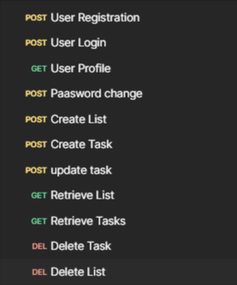

# Todo app using RestAPI

> Todo app with authentication and CRUD operations.

> JWT token authentication

> Database used MySQL.

> For API testing used POSTMAN.


## Key Features

- **User Registration**: Users can register using their name, email, and password.
- **User Authentication**: Users can log in using their email and password.
- **Token-based Authorization**: Each user is assigned a unique token for authorization of CRUD (Create, Read, Update, Delete) operations.
- **Change Password**: Change password functionality is available.
- **Profile Page Retrieval**: Retrieve your profile page option is provided.
- **List Management**: Users can create, update, retrieve, and delete lists.
- **Task Management**: Users can create multiple tasks within a single list.
- **Update Task Status**: Users can update task status.
- **Deadline Notifications**: Users can view tasks with the nearest deadlines.



## Testing
<h2> RestAPI responses </h2>

<h3> Authentication </h3>

<b>User Registration</b> 
```json
{
 "token": {
"refresh": "ey.JhbGc101JIUzI1NilsInR5cCI6IkpXVCJ9.eyJ0b2t1b190eXBlIjoicmVmcmVzaCIsImV4cCI6MTcxMzgwNDYwMywiaWF0IjoxNzEzNzE4MjAzLCJqdGk101I4MTA1MjVhZTJhN2Q0Yjg5ODYzMzQ3ZGFmYzU5Zjc4ZiIsInVzZXJfaWQ10jd9.Ygzn3pYBgZ0FNLV5j4U33_n10_qu1JUFwkigtUQN93k",
"access":
"ey.Jhbüc101JIUzI1NiIsInR5cCI6IkpXVC39.eyJ8b2t1b190eXBlIjoiYWNjZXNzIiwiZXhwIjoxNzEzNzIwNjAzLC3pYXQ10jE3MTM3MTgyMDMsImp@a5161jFjMDc2Nzhh0WF1MzRhZjRhZjJk0GY1ZThmNjg0MTg5IiwidXNlc19pZCI6N38. X43R13XTxvpKTkR3eMNLaPxgaL152VgBfDG5FcMEq5g"

"msg": "Registration Success"
 }
}
```
<b>User Login</b> 
```json
{
  "token":{
"refresh":
"eyJhbGc101JIUzI1N1IsInR5cCI6IkpXVC39.eyJ@b2t1b190eXBlIjoicmVmcmVzaCIsImV4cCI6MTcxMzgwNDY4NSw1awF0IjoxNzEzNzE4Mjg1LCJqdGk101I1YzIwMDgyYWMx0WU@M2EyYmU40GEzMWVhYzMyYzAxYSIsInVzZXJfaWQ10jF9.sWtGs3Kaqfgdx@pCICJuhhg4UBttGABGYVB70VBOLFQ",
"access":
"eyJhbGci0iJlUz1iNiIsInR5cCI6IkpXVC39.eyJ0b2tlb190@XBlIjoiYWNjZXNzIiwiZXhwIjoxNzEzNzIwNjg1LC3pYXQ10jE3MTM3MTgyODUsImp@a5161mE5Zj1hMwMyZDE@ZDR1MzVINDAwNGN.JYWM3NDQzOTUwIiwidXNlcl9pZCI6MXB. 5PzZw1pmQVH1KVxo9Xd303vCVWKsjmVEeGnNR5h9jvU"
"msg": "Login Success"
}
}
```
<b>User Profile</b> 
```json
{
 "id": 1,
"email": "rajsahu123@gmail.com",
"name": "striver"
 }

```
<b>Password Change</b> 
```json
{
  {
    "msg": "Password Changed Successfully"
}
}
```
<h3> CRUD operation </h3>

<b>Create List</b> 
```json
{
    "status": "success",
    "message": "List created successfully",
    "data": {
        "id": 7,
        "name": "Grocery",
        "description": "Purchase milk, bread, eggs, and vegetables from the grocery store."
    }
}
```

<b>Add Task</b> 
```json
{
    "status": "success",
    "message": "Task creation successful",
    "data": {
        "name": "BigBazzar work weekly",
        "description": "buy various vegatable and groccries",
        "done": false,
        "list_id": 7,
        "date": "2024-04-30",
        "priority": "High"
    }
}
```

<b>Update Task</b> 
```json
{
    "status": "success",
    "message": "Updated task status successfully",
    "data": {
        "id": 6,
        "name": "BigBazzar work weekly",
        "list_id": 7,
        "status": true,
        "description": "buy various vegatable and groccries"
    }
}
```

<b>Retrive all Task</b> 
```json
{
    "status": "success",
    "message": "Fetched tasks successfully",
    "data": [
        {
            "id": 6,
            "list_id": 7,
            "name": "BigBazzar work weekly",
            "done": true,
            "description": "buy various vegatable and groccries",
            "date": "2024-04-30",
            "priority": "High"
        }
    ]
}
```
<b>Delete Task</b> 
```json
{
    "message": "Task deleted successfully"
}
```


## Table of Contents

- [Installation](#installation)
- [API Endpoints](#api-endpoints)
- [Database](#database)
- [Testing](#testing)

## Installation

1. Clone the repository:
git clone <https://github.com/RSahu20/wobotai>

2. Navigate to the project directory:
   
```bash
todoApi/
├── api/
│ ├── init.py
│ ├── settings.py
│ ├── urls.py
│ └── wsgi.py
├── authentication/
├── todo/
├── requirements.txt
└── manage.py

```

3. Install dependencies:
``` bash
pip install -r requirements.txt
```
4. Apply database migrations:
``` bash
python manage.py makemigrations
python manage.py migrate

```

## API Endpoints

List of API endpoints with brief descriptions, request methods, and example requests/responses.

| URL | Method    | Description                |
| :-------- | :------- | :------------------------- |
| `api/user/register/` | `POST` | **Register a new user** 
| `api/user/login/`      | `POST` | **User login with a proper credentials and authentication token** |
| `api/user/profile/`      | `GET` | **Displays profile page** |
| `api/user/changepassword/`      | `POST` | **Changes User password** |
| `api/todo/lists/add/`      | `POST` | **Create list for todo operation** |
| `api/todo/lists/list/`      | `GET` | **Retrieve all lists** |\
| `api/todo/tasks/add/`      | `POST` | **Create tasks  for the list** |
| `api/todo/tasks/list/`      | `GET` | **Retrieve all tasks using particular list ** |
| `api/todo/tasks/task/update_status//`      | `POST` | **Update task status ** |
| `api/todo/lists/<int:list_id>/`      | `DELETE` | **Delete particular list by using list_id ** |
| `api/todo/tasks/<int:task_id>/`      | `DELETE` | **Delete particular task by using task_id ** |


## Database
Set up database for Mysql
``` bash
DATABASES = {
    'default': {
        'ENGINE': 'django.db.backends.mysql',
        'NAME': 'Database Name',
        'USER': 'root',
        'PASSWORD': 'PASSWORD',
        'HOST':'localhost,
        'PORT':'3306',
    }
}
```


